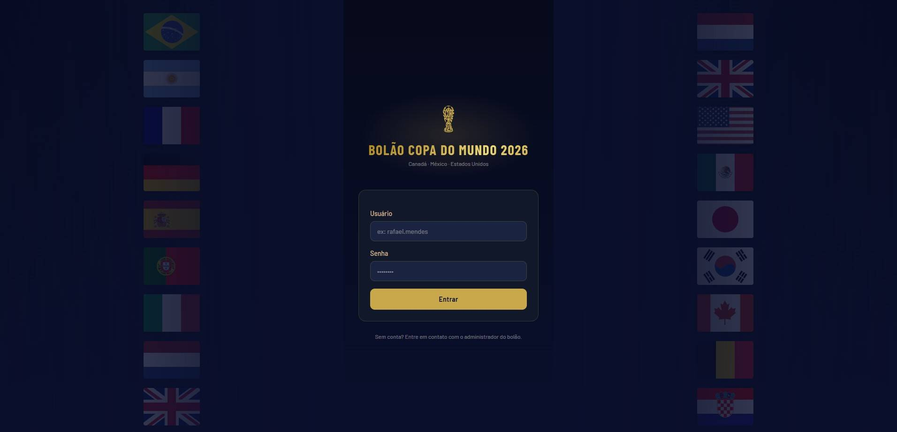
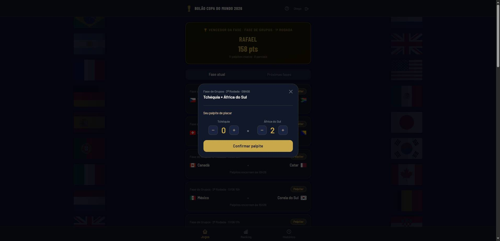
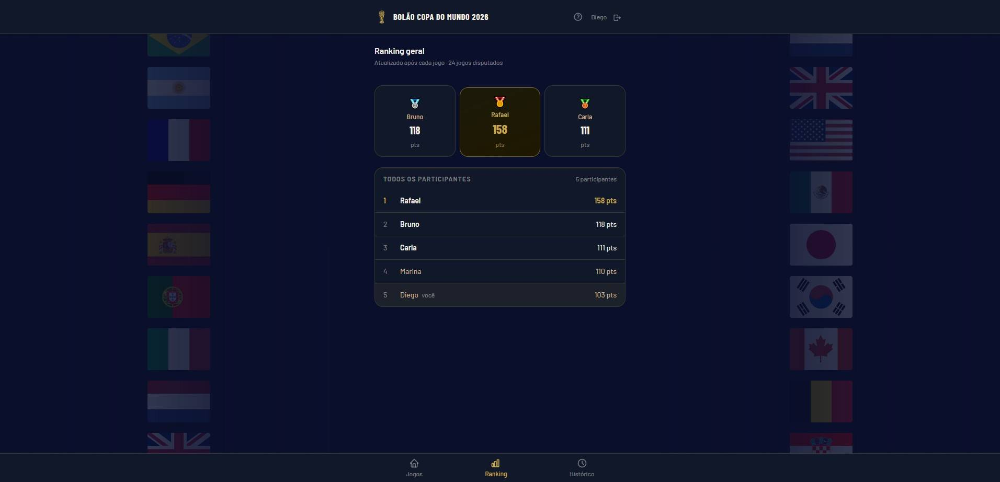
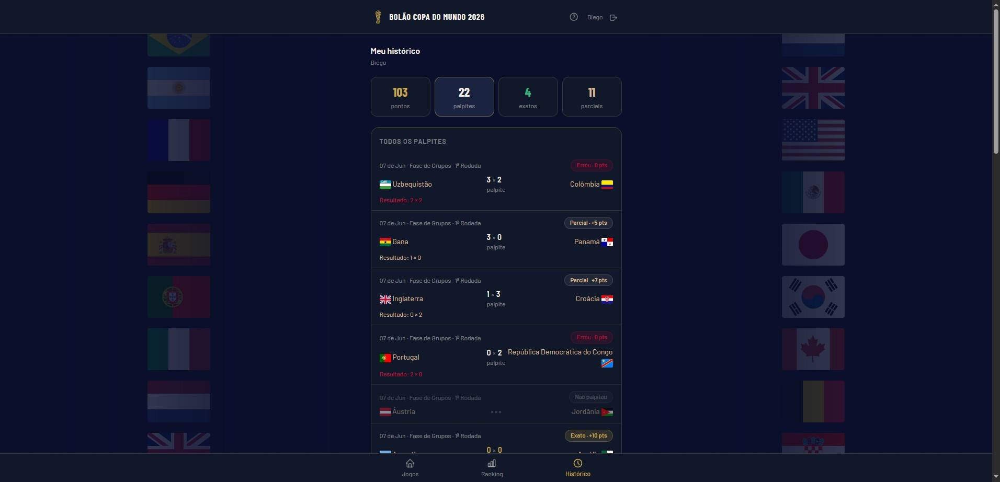

<p align="center">
  
</p>

<h1 align="center">Bolão Copa 2026 ⚽</h1>

A mobile-first **World Cup 2026 prediction pool** (*bolão*). Friends predict the
score of every match, earn points by how close they get, and climb a **live
ranking that updates the moment each match is decided**. Server-rendered Django,
dark-navy/gold UI, Brazilian-Portuguese interface.

<!-- CI badge renders once the workflow has run at least once on the default branch. -->
[](https://github.com/marcosvbs/scorecaster/actions/workflows/ci.yml)
[](LICENSE)
[](https://www.python.org/)
[](https://www.djangoproject.com/)

> The bolão started as a WhatsApp tradition with my coworkers back in the 2022
> World Cup — scores tracked by hand, rivalry too good to die in a group chat.
> This year, after a few years studying my way into software and finally
> becoming a developer, I turned it into the thing I always wanted: a proper
> app, online 24/7, that keeps the competition going on its own. It's
> **self-hostable**: clone it, point it at your group, and run your own private
> bolão. No accounts on my server, no data leaving your instance.

> **Status:** built and ready for the 2026 tournament. Fixtures and live results
> are sourced automatically from FIFA's public match-centre feed — no manual
> data entry, no API key.

---

## Screenshots

| Login | Predictions | Live ranking | History |
|:---:|:---:|:---:|:---:|
|  |  |  |  |

> _Dark-navy / gold theme, Barlow typography, fully in Brazilian Portuguese._

---

## Table of contents

- [Features](#features)
- [How scoring works](#how-scoring-works)
- [Tech stack](#tech-stack)
- [Architecture](#architecture)
- [Project structure](#project-structure)
- [Getting started (local)](#getting-started-local)
- [Configuration](#configuration)
- [Keeping the FIFA feed healthy](#keeping-the-fifa-feed-healthy)
- [Management commands](#management-commands)
- [Running with Docker](#running-with-docker)
- [Deployment](#deployment)
- [Testing](#testing)
- [Regenerating the CSS](#regenerating-the-css)
- [Contributing](#contributing)
- [License](#license)

---

## Features

- **Score predictions** for every match of the current phase, locked **30 minutes
  before kickoff**.
- **Automatic scoring** — results are fetched from FIFA and points are awarded the
  moment a match is decided. No manual data entry.
- **Live general ranking** — points appear as soon as a match is scored, even
  mid-phase, with a deterministic tiebreak chain (points → exact hits → winner
  hits → fewer skips).
- **Per-phase winners** — the platform highlights who won each phase.
- **History** — every user's past predictions and points, including matches they
  skipped ("Não palpitou").
- **Invite-only** — no public sign-up; accounts are created by an admin. Sessions
  last a year (sliding).
- **Hardened by default** — per-user/per-IP rate limiting, validated external
  data, HTTPS/HSTS/secure-cookie switches for production.
- **Runs on a shoebox** — single SQLite file, single container, no Redis, no
  build pipeline. Runs comfortably on a small VM or any container host.

## How scoring works

Points are awarded per match by comparing the prediction to the final result
(extra time counts; penalty shootouts do **not** — a 1×1 decided on penalties
scores as a draw):

| Outcome | Points |
|---|---:|
| Exact score | **10** |
| Right winner **and** right goal difference | **7** |
| Correct draw (wrong exact score) | **5** |
| Right winner only | **5** |
| Wrong | **0** |
| No prediction (skipped) | **0** (no penalty) |

The **general ranking is live and cumulative over every scored match**: the
moment a match is scored, points are recomputed and persisted as `RankingEntry`
rows, so a player's standing can move *mid-phase*. Pages always read the stored
snapshot — **predictions are never aggregated in a request path**. A **phase**
(group matchday, "Round of 16", …) groups matches sharing the same phase label
and drives per-phase winners; the current phase advances automatically once all
its matches are scored.

## Tech stack

- **Python 3.12+ / Django 6** — server-rendered templates, no SPA, no DRF.
- **SQLite** in both development and production (persistent volume), WAL mode.
- **Tailwind CSS v3** — pre-built and committed; no runtime or CI build step.
  Barlow / Barlow Condensed type, inline SVG icons.
- **Gunicorn + WhiteNoise** for production serving.
- **requests** for the FIFA HTTP client.
- **pytest + pytest-django** for tests.
- **Data source:** [`api.fifa.com`](https://api.fifa.com/api/v3) v3 (`calendar/matches`)
  — free, no API key, undocumented public JSON. One request returns the whole
  tournament (all 104 matches plus the knockout bracket).

## Architecture

The app is intentionally small and reads from the local DB on every page. The
FIFA API is **never** touched in a request path.

| Area | Module | Responsibility |
|---|---|---|
| Data model | `pool/models.py` | `Team`, `Match`, `Prediction`, `RankingEntry`, `PhaseWinner`. `Match.save()` triggers scoring when goals change. |
| Scoring rules | `pool/utils/scoring.py` | Frozen point/winner formulas (the table above). |
| Phases | `pool/services/phases.py` | Phase semantics; derives matchdays; tracks the current phase. |
| Scoring pipeline | `pool/services/scoring_service.py` | Idempotent `score_match`, phase closing, `PhaseWinner` upsert. |
| Ranking | `pool/services/ranking.py` | Recomputes the live ranking each time a match is scored and persists `RankingEntry` rows. |
| Rate limiting | `pool/services/throttle.py` | Fixed-window limiter on Django's LocMem cache (no Redis). |
| FIFA client | `pool/services/fifa_api.py` | Thin HTTP client; **normalizes/validates every field** from the undocumented feed; no DB writes. |
| Fixtures | `pool/services/fixtures.py` | The only place normalized matches become `Team`/`Match` rows. |

**Request economy (hard rules):**

- Pages read only the local DB.
- `check_results` is a cheap no-op (zero API calls) unless a match is past its
  expected end time. Run it every ~10 minutes.
- When anything is due, a single `calendar/matches` request covers every due
  match and resolves knockout placeholders as the bracket fills.
- Scored matches are never re-fetched or re-scored.

## Project structure

```
worldcup26/            Django project (settings, urls, wsgi/asgi)
pool/
├── models.py          Domain models + scoring trigger
├── views.py           matches / ranking / historic / login / save_prediction
├── urls.py
├── admin.py           account & data management (also wraps admin login throttle)
├── utils/scoring.py   frozen scoring formulas
├── services/          fifa_api, fixtures, phases, scoring_service, ranking, throttle
├── management/commands/
│   ├── seed_world_cup.py   one-off pre-launch import (teams + 104 fixtures)
│   ├── check_results.py    result fetch + scoring (run on a schedule)
│   └── backup_db.py        rotated SQLite backup
├── templates/pool/    base, login, matches, ranking, historic
├── templatetags/      template helpers
├── static/pool/       committed, pre-built tailwind.css
└── tests/             pytest suite
Dockerfile, docker-compose.yml, start.sh   container setup
```

## Getting started (local)

**Prerequisites:** Python 3.12+ and `pip`.

```bash
# 1. Clone
git clone https://github.com/marcosvbs/scorecaster.git
cd scorecaster

# 2. Virtual environment
python -m venv .venv
source .venv/bin/activate            # Windows: .venv\Scripts\activate

# 3. Dependencies
pip install -r requirements.txt

# 4. Database
python manage.py migrate

# 5. Import teams and the full fixture list (one-off)
python manage.py seed_world_cup

# 6. Create an admin account (accounts are invite-only)
python manage.py createsuperuser

# 7. Run
python manage.py runserver
```

Open <http://127.0.0.1:8000/>. Player accounts are created from the Django admin
at <http://127.0.0.1:8000/admin/> — there is no public registration.

To pull results during the tournament, run the scheduler command (see below) on a
timer, or use the Docker setup which runs it automatically.

## Configuration

All configuration is via environment variables (dev defaults are safe for local
use; set real values in production).

| Variable | Default | Notes |
|---|---|---|
| `SECRET_KEY` | dev fallback | **Required** in production. With `DEBUG=False`, the app refuses to boot on the fallback key. |
| `DEBUG` | `False` | `True` for local development. |
| `ALLOWED_HOSTS` | — | Comma-separated; required when `DEBUG=False`. |
| `CSRF_TRUSTED_ORIGINS` | — | Comma-separated origins for production. |
| `SQLITE_PATH` | `BASE_DIR/db.sqlite3` | Point at the mounted volume in production (e.g. `/data/db.sqlite3`). |
| `HTTPS_ONLY` | `False` | `True` in production: SSL redirect + secure cookies + HSTS. |
| `PORT` | `8000` | Honored by the container entrypoint (injected by the host). |
| `FIFA_API_BASE_URL` | `https://api.fifa.com/api/v3` | No API key required. |
| `FIFA_COMPETITION_ID` / `FIFA_SEASON_ID` | `17` / `285023` | World Cup 2026 identifiers. |
| `FIFA_FINISHED_STATUSES` | `0` | Comma-separated `MatchStatus` codes meaning "finished". |

Create a local `.env` (it is gitignored) for development overrides.

## Keeping the FIFA feed healthy

The data source is FIFA's **public but undocumented** match-centre JSON. It needs
no API key, but because it isn't a contracted API, identifiers and status codes
*can* shift. Everything that might move is an environment variable — you never
touch code to repair the feed:

- **`FIFA_COMPETITION_ID` / `FIFA_SEASON_ID`** identify World Cup 2026. If the
  feed returns no matches, open the official match-centre URL in your browser,
  read the competition/season IDs from the request path (or the network tab),
  and set them.
- **`FIFA_FINISHED_STATUSES`** is the `MatchStatus` code that means "finished"
  (reverse-engineered as `0`). If a result fails to score during the cup,
  inspect a finished match in the feed and add the correct code (comma-separated).
- The client is defensive by design: every field is validated in
  `normalize_*` before it can reach the DB, and a malformed match is **skipped,
  never crashes the run**. A bad feed degrades gracefully; it doesn't take the
  site down.

## Management commands

```bash
python manage.py seed_world_cup     # one-off: import all teams + 104 fixtures (idempotent)
python manage.py check_results      # fetch results + score due matches (run every ~10 min)
python manage.py backup_db          # rotated SQLite backup (keeps 3)
python manage.py createsuperuser    # create an account (invite-only model)
```

`check_results` is the heartbeat of the live tournament: cheap and API-free
unless a match has finished, in which case a single request scores everything
that is due and advances the bracket.

## Running with Docker

```bash
# Development: runserver, DEBUG on, code mounted from the host
docker compose up web

# Production simulation: gunicorn + WhiteNoise, DEBUG off, migrations on boot,
# SQLite on a named volume mounted at /data
docker compose --profile railway up --build railway
```

Both serve on <http://localhost:8000>.

> The `railway` compose profile is just a label for the production-like setup —
> rename it in `docker-compose.yml` if you prefer.

## Deployment

The app runs as a **single container** — the scheduler and the web process live
together rather than as separate services, because the SQLite file must be
reachable from the web process and a persistent volume typically mounts on a
single service/host.

`start.sh` (the container entrypoint) does, in order:

1. `migrate`
2. background loop: `check_results` every 10 minutes
3. background loop: daily `backup_db` (rotated, 3 deep) + `clearsessions`
4. `gunicorn` as PID 1 (`--workers 1 --threads 4 --timeout 60`)

A single worker keeps the in-memory rate limiter exact; threads provide
concurrency. SQLite runs in WAL mode with a 20s lock timeout so the background
writers don't block page reads.

To deploy (Railway, Render, Fly.io, or a plain VM all work the same way):

1. Build and run the `Dockerfile` as a service on your host.
2. Attach a **persistent volume** mounted at `/data`.
3. Set environment variables: `SECRET_KEY`, `DEBUG=False`, `ALLOWED_HOSTS`,
   `CSRF_TRUSTED_ORIGINS`, `HTTPS_ONLY=True`, `SQLITE_PATH=/data/db.sqlite3`.
4. After the first deploy, run `seed_world_cup` and `createsuperuser` once
   (e.g. from a one-off shell on the host).
5. If your platform can gate deploys on CI status, enable it so a red run on
   `main` blocks the deploy (see below).

### Continuous integration

`.github/workflows/ci.yml` runs on every push to `main` and every pull request:
the pytest suite (with coverage), `makemigrations --check` + `check --deploy`,
and a production Docker image build. If your host can hold a deploy until CI
passes, a red run blocks it so a broken commit never ships. CI runs entirely on
GitHub Actions.

<details>
<summary><strong>Resetting the database (for testing)</strong></summary>

The deployed state is fully reproducible: seeded teams + 104 fixtures + an admin
user, with **no predictions**. To wipe test data and return to that clean state,
run these once on the live container (or via a temporary one-shot block in
`start.sh`, removed afterwards):

```bash
python manage.py flush --noinput              # drop all rows, keep the schema
python manage.py seed_world_cup               # re-import teams + fixtures
python manage.py createsuperuser --noinput    # reads DJANGO_SUPERUSER_* env vars
```

`flush` clears predictions, test users and sessions but keeps the schema;
`seed_world_cup` is idempotent. Because the tournament has not started,
`check_results` is a no-op — there are no match scores to lose.

When using the one-shot `start.sh` block, add `DJANGO_SUPERUSER_USERNAME`,
`DJANGO_SUPERUSER_PASSWORD` and `DJANGO_SUPERUSER_EMAIL` env vars for the
non-interactive `createsuperuser`, then remove the block and delete those vars
once the reset is done.

</details>

## Testing

```bash
pytest                 # full suite
pytest --cov=pool      # with coverage
```

## Regenerating the CSS

The UI uses a pre-built, committed stylesheet at `pool/static/pool/tailwind.css`
— there is no runtime or CI build step. Regenerate it only when template classes
change, using the standalone Tailwind v3 CLI:

```bash
# https://github.com/tailwindlabs/tailwindcss/releases
tailwindcss -c tailwind.config.js -o pool/static/pool/tailwind.css --minify
```

## Contributing

Issues and pull requests are welcome. If you spin up your own bolão for a
different competition (or fix the FIFA IDs for a future tournament), a PR is the
nicest way to share it back. Before opening one, run `pytest` and
`python manage.py check --deploy` so CI stays green.

## License

[MIT](LICENSE) © 2026 Marcos Santos
